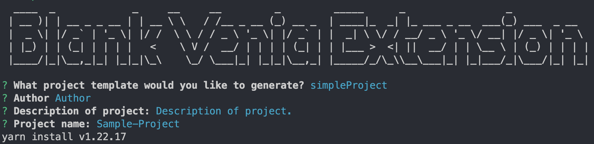

# Blank Venia Extensions

A simple cli to empty extension folder with all dependencies for Venia.



## Install

```bash
npm i blank-extension-venia
```

## Usage

```bash
blank-extension-venia
```

## Template structure

```bash
├── src
│   └── components
│   └── talons
├── babel.config.js
├── index.js
├── intercept.js
├── jest.config.js
├── prettier.config.js
├── package.json
```